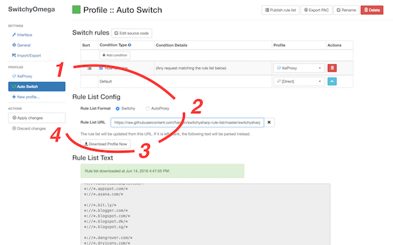

Switchysharp rule list
===
* switchysharp_rule_list.txt is for switchysharp in chrome. To help you surfe the internet scientifically. 
* switchysharp_rule_list.txt是基于switchsharp的科学上网配置文件.
* 注意, 它只是配置文件, 因此不会提供VPN或者Proxy服务.
* 使用该配置文件, 可以根据网址自动进行切换, 比如访问baidu.com不走代理, 网速会快很多.

致谢: 感谢switchysharp的作者和本repo的原作者, 本人所做的就是基于原有列表持续更新, 让科学上网更方便.
How to use
---
* 安装[SwitchyOmega](https://chrome.google.com/webstore/detail/proxy-switchyomega/padekgcemlokbadohgkifijomclgjgif?hl=en)
* 点击该插件, 选择Options
* 在左侧列表选择Auto Switch
* 在Rule List Config中Rule List Format选择Switchy, Rule List URL输入 

```
https://raw.githubusercontent.com/hanqin/switchysharp-rule-list/master/switchysharp_rule_list.txt
```
* 点击Download Profile Now
* 点击左侧的Apply Changes(重要, 千万别忘了!)

一图胜千言 
Done!

Contribute
---
* Send pull requests or raise issues.
* Email me: hanhaify#gmail.com 

Feels good? Please donate.
---


